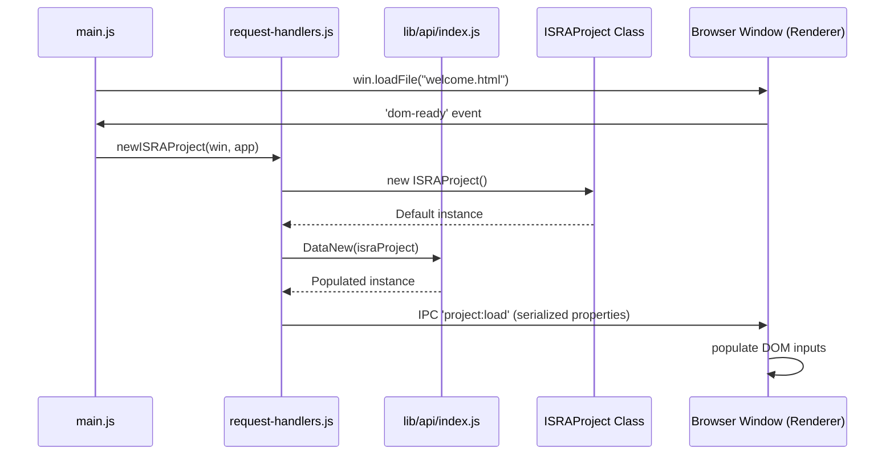
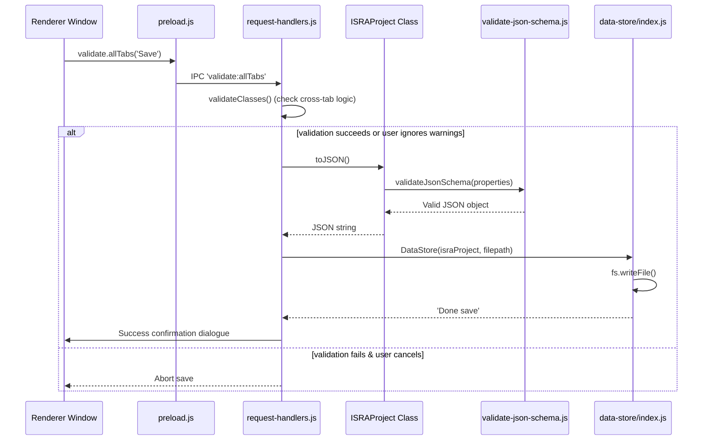
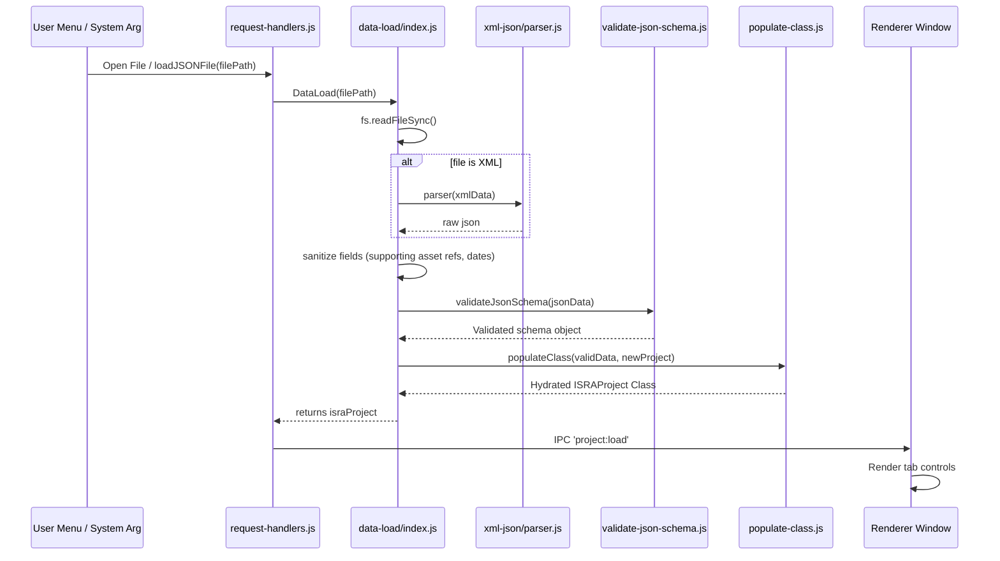
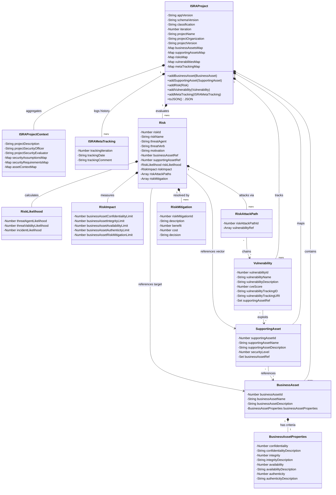

# Security Risk Assessment Tool (SRATool) Architecture Diagram & Specification

The **Security Risk Assessment Tool (SRATool)** is an Electron-based application built to evaluate security risks of engineering projects in compliance with the **ISO 27005** risk management standard.

This document details the layered architecture, core components, data model mappings, and execution flow of the application.

---

## 1. Architectural Layers Overview

SRATool is structured around a **Decoupled Layered Architecture**, separating the visual presentation layer, the desktop controller layer, and the core domain/business logic library.

```mermaid
graph TD
    subgraph Presentation Layer (Renderer Process)
        UI[HTML, CSS, JS Views]
        Libs[Chart.js, jQuery, Tabulator, TinyMCE]
        UI --> Libs
    end

    subgraph Desktop Environment (IPC Bridge)
        PB[preload.js - Context Bridge]
    end

    subgraph Host Application (Electron Main Process)
        MP[main.js - Window & Menu Lifecycle]
        RH[request-handlers.js - Main IPC Router]
        MP --> RH
    end

    subgraph Domain & Business Logic (Core Library / lib)
        API[lib/src/api - Core Service API]
        Model[lib/src/model/classes - Domain Entities]
        Schema[lib/src/model/schema - JSON Validation Schemas]
        API --> Model
        API --> Schema
    end

    %% Communications
    UI <-->|Exposed API Methods| PB
    PB <-->|IPC Send/Invoke/Receive| RH
    RH <-->|Direct Method Calls| API
```

---

## 2. Layer Analysis

### A. Presentation Layer (Renderer Process)
* **Location**: `app/src/tabs/`
* **Description**: Houses the web views for the application's tabs corresponding to ISO 27005 steps. It performs lightweight visual styling using vanilla CSS and local JavaScript logic.
* **Core Libraries**:
  * **jQuery**: Used for DOM selections, event binding, and DOM manipulation.
  * **Tabulator-Tables**: Manages tabular spreadsheets, cell editors, grid data representation, and row/column mutations (e.g. for listing assets, vulnerability lists, tracking, and risks).
  * **TinyMCE**: Powers HTML rich-text rendering for description/documentation blocks.
  * **Chart.js**: Generates the final risk assessment charts in the Report tab.
* **Component tabs**:
  * `Welcome` (`app/src/tabs/Welcome/`): Renders tracking history records and coordinates application-wide settings.
  * `Project Context` (`app/src/tabs/Project Context/`): Captures the scope of assessments, attachments (diagrams, text files), and reference URLs.
  * `Business Assets` (`app/src/tabs/Business Assets/`): Manages high-level primary assets with security quality indicators.
  * `Supporting Assets` (`app/src/tabs/Supporting Assets/`): Connects physical/logical technical systems to Business Assets.
  * `Vulnerabilities` (`app/src/tabs/Vulnerabilities/`): Manages vulnerabilities list, scores (0-10), and mappings to supporting assets.
  * `Risks` (`app/src/tabs/Risks/`): Chains Threat Agents -> Threat Verbs -> Supporting Assets -> Business Assets with custom combinations of Vulnerability Attack Paths (incident scenarios).
  * `Report` (`app/src/tabs/Report/`): Compiles findings, builds visualizations, and enables HTML/PDF export.
  * `Import` (`app/src/tabs/Import/`): Uploads and translates legacy assessment templates.

### B. IPC Bridge Layer
* **Location**: `app/src/electron/preload.js`
* **Description**: A security-enforced layer that prevents direct access to Node.js APIs from the renderer's browser window. It registers designated channels in `contextBridge.exposeInMainWorld()`.
* **Exposed Context Objects**:
  * `window.project`: Handles loading events and tracking revisions.
  * `window.render`: Triggered by page navigations between tabs.
  * `window.validate`: Propagates DOM/tab-level values for validations.
  * `window.welcome`, `window.projectContext`, `window.businessAssets`, `window.supportingAssets`, `window.risks`, `window.vulnerabilities`: Exposes sub-features (adding/updating/deleting list rows).

### C. Host Application Layer (Electron Main Process)
* **Location**: [app/src/electron/main.js](file:///c:/Users/RasmiranjanNAYAK/thales/ags/poc/security-risk-assessment-tool/app/src/electron/main.js)
* **Description**: Runs with full system access. Launches the host desktop window, maximizes views, defines system menus (File, Edit, Window), and listens to lifecycle changes.
* **IPC Controller ([request-handlers.js](file:///c:/Users/RasmiranjanNAYAK/thales/ags/poc/security-risk-assessment-tool/app/src/electron/request-handlers.js))**:
  * Tracks the active `ISRAProject` domain instance.
  * Acts as the controller in the MVC-pattern, routing window inputs and delegating business computations to the backend library API.
  * Coordinates multi-tab schema validations (`validateClasses()`) before saving documents.

### D. Backend Library / Core Logic Layer (lib)
* **Location**: [lib/src/](file:///c:/Users/RasmiranjanNAYAK/thales/ags/poc/security-risk-assessment-tool/lib/src)
* **Description**: An independent, self-contained module containing calculations, sanitizers, and validation logic.
* **API Entrypoint ([lib/src/api/index.js](file:///c:/Users/RasmiranjanNAYAK/thales/ags/poc/security-risk-assessment-tool/lib/src/api/index.js))**:
  * `DataNew`: Returns a blank project template initialized to organizational defaults.
  * `DataLoad`: Loads raw files, sanitizes fields, validates structure against the JSON schema, and instantiates an `ISRAProject` class representation.
  * `DataStore`: Serializes `ISRAProject` domains to valid JSON strings and writes them to local storage.
  * `XML2JSON`: Translates legacy XML structures to the unified JSON schema.
* **Validation Subsystem ([lib/src/model/schema/json-schema.js](file:///c:/Users/RasmiranjanNAYAK/thales/ags/poc/security-risk-assessment-tool/lib/src/model/schema/json-schema.js))**:
  * Utilizes `ajv` (Another JSON Schema Validator) to validate data objects. Ensure structural verification and schema integrity.
* **Object Models ([lib/src/model/classes/](file:///c:/Users/RasmiranjanNAYAK/thales/ags/poc/security-risk-assessment-tool/lib/src/model/classes))**:
  * Defines domain entities: `ISRAProject`, `BusinessAsset`, `SupportingAsset`, `Risk`, `Vulnerability`, `ISRAProjectContext`, and `ISRAMetaTracking`. Private fields (`#fieldName`) protect object mutations.

---

## 3. Operations & Data Flow

### A. Creating a New Project (Default Load)


### B. Saving an Existing Project


### C. Loading a Project File


---

## 4. Class Relationship Diagram

Domain objects are linked together. An `ISRAProject` aggregates collections of other domain entities:


